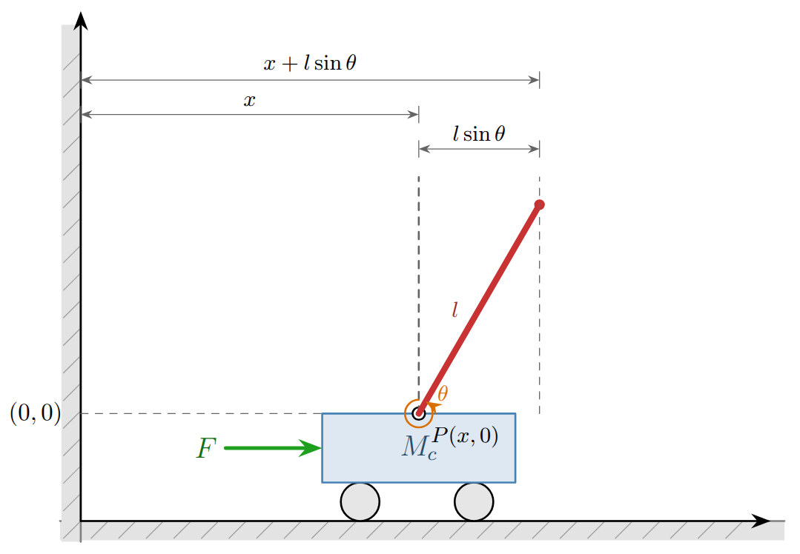
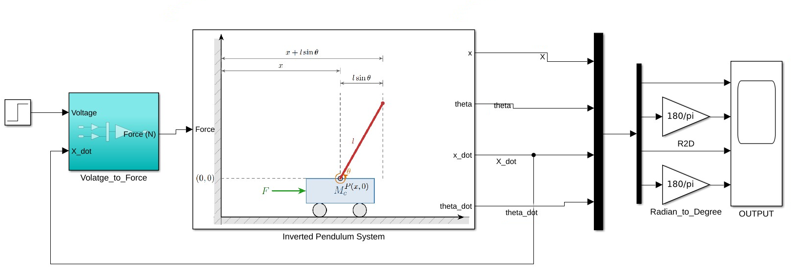
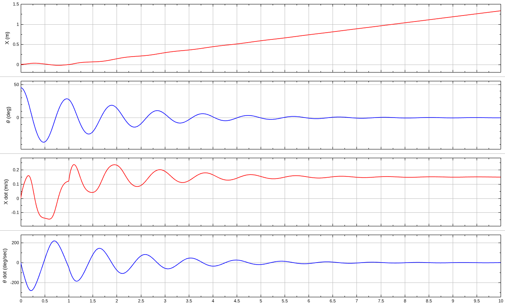
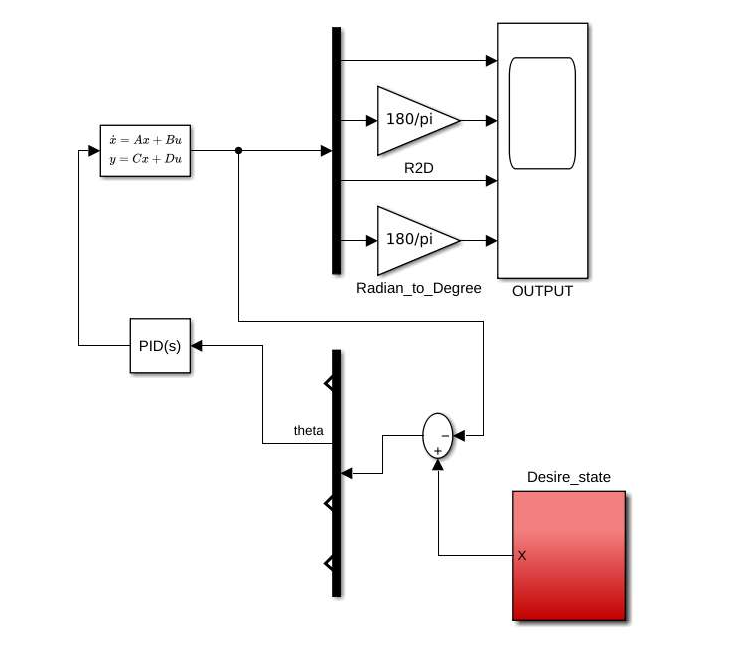
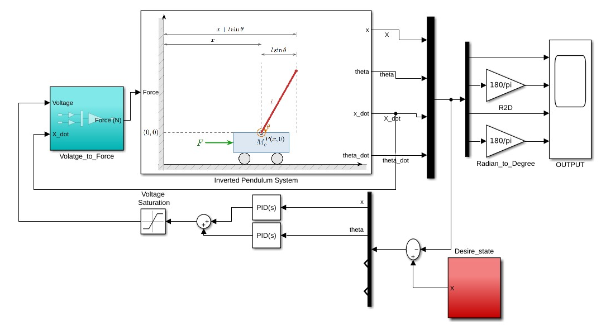
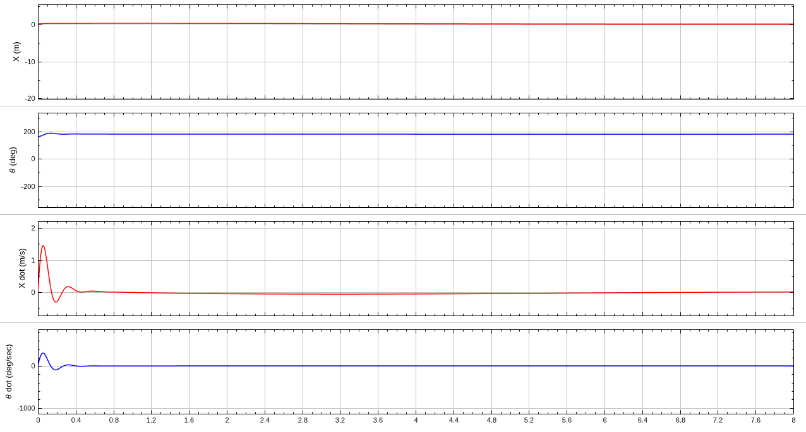

## 0. Índex

- [0. Índex](#0-índex)
- [1. Introducció](#1-introducció)
  - [1.1 Motivació](#11-motivació)
  - [1.2 Enunciat](#12-enunciat)
  - [1.3 Metodologia](#13-metodologia)
- [2. Model del pèndol](#2-model-del-pèndol)
  - [2.1 Equacions del moviment](#21-equacions-del-moviment)
  - [2.2 Model no lineal](#22-model-no-lineal)
  - [2.3 Linearització](#23-linearització)
  - [2.4 Model en espai d’estats, controlabilitat, observabilitat i estabilitat](#24-model-en-espai-destats-controlabilitat-observabilitat-i-estabilitat)
- [3. PID](#3-pid)
  - [3.1 Introducció al control clàssic](#31-introducció-al-control-clàssic)
  - [3.2 Ús del PID i efecte dels guanys](#32-ús-del-pid-i-efecte-dels-guanys)
  - [3.3 Implementació del controlador PID al pèndol invertit amb Simulink](#33-implementació-del-controlador-pid-al-pèndol-invertit-amb-simulink)
- [4. Controlador LQR](#4-controlador-lqr)
- [5. Filtre de Kalman](#5-filtre-de-kalman)
- [6. Controlador LQG](#6-controlador-lqg)
- [7. Extensions](#7-extensions)
  - [7.1 Primera extensió](#71-primera-extensió)
  - [7.2 Segona extensió](#72-segona-extensió)
- [8. Conclusions](#8-conclusions)
- [9. Referències](#9-referències)

## 1. Introducció

Aquest projecte té com a propòsit principal la representació, l'anàlisi i el disseny de sistemes dinàmics. L'objectiu és interioritzar conceptes clau d'aquesta disciplina, com ara l'estabilitat, l'observabilitat i la controlabilitat, i aplicar-los al disseny pràctic de controladors capaços de governar fenòmens físics que evolucionen en el temps dins d'un entorn real.

### 1.1 Motivació

La principal raó per desenvolupar aquest treball és que el pèndol invertit actua com un banc de proves ideal per aprendre i validar diverses metodologies de control. En concret, ens permet explorar des del control clàssic PID (Proporcional-Integral-Derivatiu) fins a tècniques d'estat modernes com el Regulador Quadràtic Lineal (LQR), el filtre de Kalman i el Regulador Quadràtic Lineal Gaussià (LQG). Dominar aquestes eines és un pas fonamental per poder dissenyar sistemes de control robustos en l'enginyeria.

### 1.2 Enunciat

Per a la realització de la pràctica, partim de dos documents principals. D'una banda, un treball de referència enfocat en la física i control del pèndol invertit[[1]](#bib1). I, de l'altra, un segon projecte implementat en Simulink que ens serveix de pauta metodològica: Design of a Linear Quadratic Gaussian Control System for a Thrust Vector Controlled Rocket[[2]](#bib2)
La tasca central consisteix a replicar l'estructura i el mètode d'aquest darrer treball, però aplicant-ho sobre el sistema del pèndol invertit. A més a més, s'hauran de desenvolupar dos casos propis d'estudi (modificacions lliures) on es treballi sobre dues referències diferents: la posició del carro i l'angle del pèndol.
Caldrà entregar una memòria que inclogui els objectius, el modelat, el treball realitzat i les conclusions, acompanyada d'un resum de 5 diapositives de presentació i la totalitat del codi (MATLAB/Simulink) generat. La qualificació es fonamentarà en la fidelitat amb què s'imiti l'enfocament del treball de referència, la solidesa de les dues extensions proposades i la qualitat del lliurament de les diapositives.

### 1.3 Metodologia

A partir de les equacions de moviment del sistema físic, el primer pas serà derivar un model continu i lineal en l'espai d'estats. Aprofitant el coneixement previ de la dinàmica del pèndol, es definiran les matrius $A, B, C, D$ que descriuen el seu comportament prop de l'equilibri.
Un cop establert aquest espai d'estats, es procedirà a implementar diverses estratègies de control per observar-ne els efectes sobre l'estabilitat i l'angle. Inicialment, dins del marc del control clàssic, es dissenyarà un controlador PID per corregir les pertorbacions angulars; atesa la inestabilitat inherent de la planta, caldrà sintonitzar de manera acurada els guanys proporcional, integral i derivatiu per forçar la posició vertical desitjada.
En la següent fase, s'emprarà MATLAB i Simulink per dissenyar un regulador LQR, definint les matrius de ponderació $Q$ i $R$ de la funció de cost per tal d'assolir uns guanys de realimentació òptims. Com que s'haurà comprovat que el sistema és completament controlable i observable, també s'implementarà un filtre de Kalman encarregat d'estimar l'estat intern del pèndol invertit basant-se únicament en els senyals de sortida. Finalment, gràcies al principi de separació, el filtre de Kalman i el LQR s'integraran per conformar un controlador LQG, aconseguint així una resposta dinàmica global òptima.

## 2. Model del pèndol

Primer de tot, definim la nomenclatura i les unitats que s’utilitzaran al llarg del model dinàmic del pèndol invertit sobre carro. Aquesta taula serveix com a referència per a totes les expressions que apareixeran més endavant i ajuda a mantenir una notació clara i coherent durant tota la secció.

  
Nomenclatura del model del pèndol invertit sobre carro

  <table>
    <thead>
      <tr>
        <th>Símbol</th>
        <th>Descripció</th>
        <th>Unitats SI</th>
      </tr>
    </thead>
    <tbody>
      <tr>
        <td><math><mi>x</mi></math></td>
        <td>Posició horitzontal del carro</td>
        <td>m</td>
      </tr>
      <tr>
        <td><math><mi>θ</mi></math></td>
        <td>Angle del pèndol respecte de la vertical, positiu en sentit antihorari</td>
        <td>rad</td>
      </tr>
      <tr>
        <td><math><mover><mi>x</mi><mo>˙</mo></mover></math></td>
        <td>Velocitat horitzontal del carro</td>
        <td>m/s</td>
      </tr>
      <tr>
        <td><math><mover><mi>θ</mi><mo>˙</mo></mover></math></td>
        <td>Velocitat angular del pèndol</td>
        <td>rad/s</td>
      </tr>
      <tr>
        <td><math><mover><mi>x</mi><mo>¨</mo></mover></math></td>
        <td>Acceleració horitzontal del carro</td>
        <td>m/s2</td>
      </tr>
      <tr>
        <td><math><mover><mi>θ</mi><mo>¨</mo></mover></math></td>
        <td>Acceleració angular del pèndol</td>
        <td>rad/s2</td>
      </tr>
      <tr>
        <td><math><msub><mi>x</mi><mi>p</mi></msub></math></td>
        <td>Coordenada horitzontal del centre de gravetat del pèndol</td>
        <td>m</td>
      </tr>
      <tr>
        <td><math><msub><mi>y</mi><mi>p</mi></msub></math></td>
        <td>Coordenada vertical del centre de gravetat del pèndol</td>
        <td>m</td>
      </tr>
      <tr>
        <td><math><msub><mi>M</mi><mi>c</mi></msub></math></td>
        <td>Massa del carro</td>
        <td>kg</td>
      </tr>
      <tr>
        <td><math><mi>m</mi></math></td>
        <td>Massa del pèndol, concentrada al centre de gravetat</td>
        <td>kg</td>
      </tr>
      <tr>
        <td><math><mi>l</mi></math></td>
        <td>Distància des del pivot fins al centre de gravetat del pèndol</td>
        <td>m</td>
      </tr>
      <tr>
        <td><math><mi>I</mi></math></td>
        <td>Moment d’inèrcia del pèndol respecte del pivot</td>
        <td>kg·m2</td>
      </tr>
      <tr>
        <td><math><mi>c</mi></math></td>
        <td>Coeficient de fricció viscosa del carro</td>
        <td>N·s/m</td>
      </tr>
      <tr>
        <td><math><mi>b</mi></math></td>
        <td>Coeficient d’amortiment viscós al pivot</td>
        <td>N·m·s/rad</td>
      </tr>
      <tr>
        <td><math><mi>g</mi></math></td>
        <td>Acceleració de la gravetat</td>
        <td>m/s2</td>
      </tr>
      <tr>
        <td><math><mi>F</mi></math></td>
        <td>Força de control aplicada al carro</td>
        <td>N</td>
      </tr>
      <tr>
        <td><math><mi>u</mi></math></td>
        <td>Entrada de control, definida com <math><mi>u</mi><mo>=</mo><mi>F</mi></math></td>
        <td>N</td>
      </tr>
      <tr>
        <td><math><mi>T</mi></math></td>
        <td>Energia cinètica total del sistema</td>
        <td>J</td>
      </tr>
      <tr>
        <td><math><mi>U</mi></math></td>
        <td>Energia potencial del sistema</td>
        <td>J</td>
      </tr>
      <tr>
        <td><math><mi mathvariant="script">L</mi></math></td>
        <td>Lagrangià del sistema, definit com <math><mi mathvariant="script">L</mi><mo>=</mo><mi>T</mi><mo>-</mo><mi>U</mi></math></td>
        <td>J</td>
      </tr>
      <tr>
        <td><math><mi>Δ</mi></math></td>
        <td>Denominador comú de les expressions no lineals de les acceleracions</td>
        <td>kg2·m2</td>
      </tr>
      <tr>
        <td><math><mi>α</mi></math></td>
        <td>Valor de <math><mi>Δ</mi></math> al punt d’equilibri de linealització</td>
        <td>kg2·m2</td>
      </tr>
      <tr>
        <td><math><mi mathvariant="bold">x</mi></math></td>
        <td>Vector d’estat del sistema</td>
        <td>-</td>
      </tr>
      <tr>
        <td><math><mi mathvariant="bold">y</mi></math></td>
        <td>Vector de sortida del sistema</td>
        <td>-</td>
      </tr>
      <tr>
        <td><math><mi>A</mi></math></td>
        <td>Matriu d’estat del model linealitzat</td>
        <td>-</td>
      </tr>
      <tr>
        <td><math><mi>B</mi></math></td>
        <td>Matriu d’entrada del model linealitzat</td>
        <td>-</td>
      </tr>
      <tr>
        <td><math><mi>C</mi></math></td>
        <td>Matriu de sortida</td>
        <td>-</td>
      </tr>
      <tr>
        <td><math><mi>D</mi></math></td>
        <td>Matriu de transmissió directa</td>
        <td>-</td>
      </tr>
      <tr>
        <td><math><mi mathvariant="script">C</mi></math></td>
        <td>Matriu de controlabilitat</td>
        <td>-</td>
      </tr>
      <tr>
        <td><math><mi mathvariant="script">O</mi></math></td>
        <td>Matriu d’observabilitat</td>
        <td>-</td>
      </tr>
    </tbody>
  </table>
  
Taula 1. Nomenclatura i unitats utilitzades en el model dinàmic del pèndol invertit sobre carro.

### 2.1 Equacions del moviment

El sistema que es vol controlar és un pèndol invertit muntat sobre un carro que es desplaça lliurement en la direcció horitzontal. L’objectiu és aplicar una força $F$ sobre el carro per mantenir el pèndol en la posició vertical cap amunt, que constitueix un punt d’equilibri inestable. El sistema té dos graus de llibertat: la posició horitzontal del carro, $x$, i l’angle del pèndol respecte de la vertical, $\theta$:

  

    
    
Figura 1: Diagrama esquemàtic del pèndol invertit sobre carro 

  

Els paràmetres físics del model són $M_c$, la massa del carro; $m$, la massa del pèndol; $l$, la distància des del pivot fins al centre de gravetat; $I$, el moment d’inèrcia del pèndol respecte del pivot; $c$, el coeficient de fricció viscosa del carro; $b$, el coeficient d’amortiment viscós al pivot; i $g$, l’acceleració de la gravetat.

Per començar, es descriu la cinemàtica del sistema. Si $x_p$ i $y_p$ representen les coordenades absolutes del centre de gravetat del pèndol, la geometria del mecanisme porta a:

$$
    \begin{bmatrix}
    x_p \\\\
    y_p
    \end{bmatrix}
    =
    \begin{bmatrix}
    x + l\sin\theta \\\\
    - l\cos\theta
    \end{bmatrix}
$$

Derivant respecte del temps, s’obtenen les velocitats del centre de gravetat:

$$
    \dot{x}_p = \dot{x} + l\dot{\theta}\cos\theta,
    \qquad
    \dot{y}_p = -l\dot{\theta}\sin\theta
$$

Un cop definida la cinemàtica, es pot plantejar el model dinàmic mitjançant el mètode d’Euler-Lagrange. Aquest enfocament és especialment útil perquè permet obtenir les equacions del moviment a partir de les energies del sistema. El Lagrangià es defineix com:

$$
    \mathcal{L} = T - U
$$

on $T$ és l’energia cinètica total i $U$ és l’energia potencial.

En aquest model, l’energia potencial només depèn del pèndol i queda escrita com:

$$
    U = - mgl\cos\theta
$$

L’energia cinètica total és la suma de la contribució del carro i la del pèndol. La del carro és:

$$
    T_{\text{carro}} = \frac{1}{2}M_c\dot{x}^2
$$

La del pèndol es divideix en una part translacional i una part rotacional. La part translacional s’obté a partir de les velocitats del centre de gravetat:

$$
    T_{\text{pèndol}}
    =
    \frac{1}{2}m\left[
    (\dot{x} + l\dot{\theta}\cos\theta)^2
    +
    (l\dot{\theta}\sin\theta)^2
    \right]
    +
    \frac{1}{2}I\dot{\theta}^2
$$

Desenvolupant els termes i utilitzant la identitat $\sin^2\theta + \cos^2\theta = 1$, l’energia cinètica total del sistema es pot simplificar a:

$$
    T
    =
    \frac{1}{2}(M_c + m)\dot{x}^2
    +
    \frac{1}{2}(I + ml^2)\dot{\theta}^2
    +
    ml\dot{x}\dot{\theta}\cos\theta
$$

Per tant, el Lagrangià complet queda:

$$ 
\mathcal{L} = \frac{1}{2} (M_c + m)\dot{x}^2 + \frac{1}{2} (I + ml^2)\dot{\theta}^2 + ml\dot{x}\dot{\theta} \cos\theta + mgl \cos\theta 
$$

Com que el sistema té dues coordenades generalitzades, $x$ i $\theta$, cal aplicar dues equacions d’Euler-Lagrange. La força generalitzada associada a $x$ és $F - c\dot{x}$, mentre que la força generalitzada associada a $\theta$ és $-b\dot{\theta}$. Així, les equacions corresponents són:

$$
    \frac{d}{dt}\left(\frac{\partial \mathcal{L}}{\partial \dot{x}}\right)
    -
    \frac{\partial \mathcal{L}}{\partial x}
    =
    F - c\dot{x}
$$

$$
    \frac{d}{dt}\left(\frac{\partial \mathcal{L}}{\partial \dot{\theta}}\right)
    -
    \frac{\partial \mathcal{L}}{\partial \theta}
    =
    -b\dot{\theta}
$$

Després de calcular les derivades parcials i simplificar, s’obtenen les equacions del moviment no lineals del sistema:

$$ 
  (M_c + m)\ddot{x} + ml\ddot{\theta} \cos\theta - ml\dot{\theta}^2 \sin\theta = F - c\dot{x} 
$$
$$ 
  (I + ml^2)\ddot{\theta} + ml\ddot{x} \cos\theta + mgl \sin\theta = -b\dot{\theta} 
$$

Aquestes són les equacions bàsiques que descriuen la dinàmica del pèndol invertit sobre carro. En aquesta forma encara no són adequades per al disseny del controlador, perquè les dues acceleracions apareixen acoblades i el model és no lineal.

### 2.2 Model no lineal

Per escriure el sistema en forma d’espai d’estats, primer cal aïllar $\ddot{x}$ i $\ddot{\theta}$. Per fer-ho, es defineix el denominador comú:

$$
    \Delta = (M_c + m)(I + ml^2) - m^2l^2\cos^2\theta
$$

Resolent el sistema format per les dues equacions del moviment respecte de les dues acceleracions, s’arriba a:

$$
    \ddot{x}
    =
    \frac{
    (I + ml^2)\bigl(F - c\dot{x} + ml\dot{\theta}^2\sin\theta\bigr)
    -
    ml\cos\theta\bigl(mgl\sin\theta - b\dot{\theta}\bigr)
    }{
    \Delta
    }
$$

$$
    \ddot{\theta}
    =
    \frac{
    (M_c + m)\bigl(mgl\sin\theta - b\dot{\theta}\bigr)
    -
    ml\cos\theta\bigl(F - c\dot{x} + ml\dot{\theta}^2\sin\theta\bigr)
    }{
    \Delta
    }
$$

A continuació es defineixen les variables d’estat habituals del problema:

$$
    x_1 = x,
    \qquad
    x_2 = \theta,
    \qquad
    x_3 = \dot{x},
    \qquad
    x_4 = \dot{\theta}
$$

Amb aquesta definició, el vector d’estat es pot escriure com:

$$
    \mathbf{x}
    =
    \begin{bmatrix}
    x \\\\
    \theta \\\\
    \dot{x} \\\\
    \dot{\theta}
    \end{bmatrix}
$$

Prenent com a entrada de control la força aplicada al carro, és a dir, $u = F$, el model no lineal en espai d’estats queda:

$$
    \dot{\mathbf{x}}
    =
    \begin{bmatrix}
    \dot{x} \\\\
    \dot{\theta} \\\\
    f_3(x,\theta,\dot{x},\dot{\theta},u) \\\\
    f_4(x,\theta,\dot{x},\dot{\theta},u)
    \end{bmatrix}
$$

on les funcions $f_3$ i $f_4$ són, respectivament, les expressions de $\ddot{x}$ i $\ddot{\theta}$ obtingudes abans. Si s’escriuen explícitament en funció dels estats $x_1$, $x_2$, $x_3$ i $x_4$, s’obté:

$$
    \dot{\mathbf{x}} =
    \begin{bmatrix}
    x_3 \\\\
    x_4 \\\\
    \frac{(I + ml^2)(u - cx_3 + mlx_4^2 \sin x_2) + ml \cos x_2 (mgl \sin x_2 + bx_4)}{I(M_c + m) + M_cml^2 + m^2l^2 \sin^2 x_2} \\\\
    \frac{-(M_c + m)(mgl \sin x_2 + bx_4) - ml \cos x_2 (u - cx_3 + mlx_4^2 \sin x_2)}{I(M_c + m) + M_cml^2 + m^2l^2 \sin^2 x_2}
    \end{bmatrix}
$$

Aquesta expressió és el model no lineal complet del sistema. És la forma adequada per simular la dinàmica real del pèndol, però no és la més pràctica per aplicar tècniques de control lineal com LQR o LQG. Per aquest motiu, el pas següent és linealitzar el sistema al voltant d’un punt d’equilibri.

### 2.3 Linearització

Les equacions del moviment no lineals obtingudes anteriorment descriuen correctament la dinàmica del pèndol invertit, però encara no són adequades per al disseny d’un controlador lineal. Per aquest motiu, el següent pas és reescriure el sistema en forma d’espai d’estats i, posteriorment, linealitzar-lo al voltant d’un punt d’operació d’interès.

Partim de les equacions del moviment:

$$ 
  (M_c + m)\ddot{x} + ml\ddot{\theta}\cos\theta - ml\dot{\theta}^2\sin\theta = F - c\dot{x} 
$$
$$ 
  (I + ml^2)\ddot{\theta} + ml\ddot{x}\cos\theta + mgl\sin\theta = -b\dot{\theta} 
$$

Per obtenir una representació en espai d’estats, primer cal aïllar les acceleracions $\ddot{x}$ i $\ddot{\theta}$. Si es pren $\ddot{x}$ de la segona equació, s’obté:

$$ 
  \ddot{x} = \frac{-b\dot{\theta} - mgl\sin\theta - (I + ml^2)\ddot{\theta}}{ml\cos\theta} 
$$

Substituint aquesta expressió a la primera equació, es pot obtenir $\ddot{\theta}$ en funció dels estats i de l’entrada. El resultat és:

$$ 
  \ddot{\theta} = \frac{-\left( (M_c + m)(b\dot{\theta} + mgl\sin\theta) + ml\cos\theta(F - c\dot{x} + ml\dot{\theta}^2\sin\theta) \right)}{m^2l^2\sin^2\theta + M_cml^2 + (M_c + m)I} 
$$

De manera similar, si aïllem ara $\ddot{\theta}$ de la primera equació, resulta:

$$ 
  \ddot{\theta} = \frac{F - c\dot{x} - (M_c + m)\ddot{x} + ml\dot{\theta}^2\sin\theta}{ml\cos\theta} 
$$

Substituint aquesta expressió a la segona equació, s’arriba a la forma explícita de $\ddot{x}$: 

$$ 
  \ddot{x} = \frac{bml\dot{\theta}\cos\theta + m^2l^2g\sin\theta\cos\theta + (I + ml^2)(F - c\dot{x} + ml\dot{\theta}^2\sin\theta)}{m^2l^2\sin^2\theta + M_cml^2 + (M_c + m)I} 
$$

Un cop aïllades les acceleracions, es defineixen les variables d’estat habituals del sistema:

$$
    x_1 = x,
    \qquad
    x_2 = \theta,
    \qquad
    x_3 = \dot{x},
    \qquad
    x_4 = \dot{\theta}
$$

Amb aquesta definició, les equacions d’estat associades a $\dot{x}_3$ i $\dot{x}_4$ queden:

$$
    \dot{x}_3
    =
    \frac{
    bmlx_4\cos x_2
    +
    m^2l^2g\sin x_2\cos x_2
    +
    (I + ml^2)\left(F - cx_3 + mlx_4^2\sin x_2\right)
    }{
    Mml^2 + (M + m)I + m^2l^2\sin^2 x_2
    }
$$

$$
    \dot{x}_4
    =
    \frac{
    -\left(
    Fml\cos x_2
    -
    cmlx_3\cos x_2
    +
    m^2l^2x_4^2\sin x_2\cos x_2
    +
    (M + m)(bx_4 + mgl\sin x_2)
    \right)
    }{
    Mml^2 + (M + m)I + m^2l^2\sin^2 x_2
    }
$$

Per tant, el model no lineal final en forma d’espai d’estats es pot escriure com:

$$
    \frac{d}{dt}
    \begin{bmatrix}
    x_1 \\\\
    x_2 \\\\
    x_3 \\\\
    x_4
    \end{bmatrix}
    =
    \begin{bmatrix}
    x_3 \\\\
    x_4 \\\\
    \frac{bmlx_4 \cos x_2 + m^2l^2g \sin x_2 \cos x_2 + (I + ml^2)(F - cx_3 + mlx_4^2 \sin x_2)}{Mml^2 + (M + m)I + m^2l^2 \sin^2 x_2} \\\\
    \frac{-(M + m)(mgl \sin x_2 + bx_4) - ml \cos x_2 (F - cx_3 + mlx_4^2 \sin x_2)}{Mml^2 + (M + m)I + m^2l^2 \sin^2 x_2}
    \end{bmatrix}
$$

Si es consideren com a sortides totes les variables d’estat, la sortida del sistema queda definida per:

$$
    Y
    =
    CX
    =
    \begin{bmatrix}
    1 & 0 & 0 & 0 \\\\
    0 & 1 & 0 & 0 \\\\
    0 & 0 & 1 & 0 \\\\
    0 & 0 & 0 & 1
    \end{bmatrix}
    \begin{bmatrix}
    x \\\\
    \theta \\\\
    \dot{x} \\\\
    \dot{\theta}
    \end{bmatrix}
$$

Si es vol obtenir un model lineal local al voltant del punt estacionari vertical, cal linealitzar aquest sistema no lineal. Definim el camp vectorial com:

$$
    f(X,U) =
    \begin{bmatrix}
    x_3 \\\\
    x_4 \\\\
    \frac{bmlx_4 \cos x_2 + m^2l^2g \sin x_2 \cos x_2 + (I + ml^2)(F - cx_3 + mlx_4^2 \sin x_2)}{Mml^2 + (M + m)I + m^2l^2 \sin^2 x_2} \\\\
    \frac{-(M + m)(mgl \sin x_2 + bx_4) - ml \cos x_2 (F - cx_3 + mlx_4^2 \sin x_2)}{Mml^2 + (M + m)I + m^2l^2 \sin^2 x_2}
    \end{bmatrix}
$$

La linealització es fa utilitzant una expansió de Taylor de primer ordre i la matriu jacobiana. El model no lineal és:

$$
    \dot{X} = f(X,U)
$$

i es vol obtenir un model lineal local al voltant d’un punt d’operació:

$$
    (X_0,U_0) \rightarrow (X = X_0 + \delta X,\; U = U_0 + \delta U)
$$

Així, la dinàmica al voltant del punt d’operació es pot escriure com:

$$
    \delta\dot{X} = f(X_0 + \delta X,\; U_0 + \delta U)
$$

Aplicant l’expansió de Taylor de primer ordre, s’obté:

$$
    \delta\dot{X}
    =
    f(X_0,U_0)
    +
    \frac{\partial f}{\partial X}(X_0,U_0)\delta X
    +
    \frac{\partial f}{\partial U}(X_0,U_0)\delta U
    +
    \text{H.O.T}
$$

Si es tria un punt d’operació que sigui realment un punt d’equilibri, es compleix que:

$$
    f(X_0,U_0) = 0
$$

En aquest cas, el punt de referència escollit és el punt estacionari vertical:

$$
    (X_0,U_0)
    =
    \left(
    \begin{bmatrix}
    0 \\\\
    \pi \\\\
    0 \\\\
    0
    \end{bmatrix},
    0
    \right)
$$

Despreciant els termes d’ordre superior, el sistema linealitzat queda:

$$
    \delta\dot{X} = A\delta X + B\delta U
$$

$$
    Y = C\delta X
$$

Re-definint $\delta X \approx X$ i $\delta U \approx U$, s’arriba a la forma lineal estàndard:
$$
    \dot{X} = AX + BU
$$

$$
    Y = CX
$$

on les matrius del sistema són:

$$
    A = \frac{\partial f}{\partial X}\bigg|_{(X_0,U_0)}
$$

$$
    B = \frac{\partial f}{\partial U}\bigg|_{(X_0,U_0)}
$$

Linealitzant l’equació no lineal anterior al voltant del punt de referència, s’obté la matriu d’estat:
$$
    A
    =
    \begin{bmatrix}
    0 & 0 & 1 & 0 \\\\
    0 & 0 & 0 & 1 \\\\
    0 & \dfrac{m^2l^2g}{\alpha} & -\dfrac{(I + ml^2)c}{\alpha} & -\dfrac{bml}{\alpha} \\\\
    0 & \dfrac{mgl(M + m)}{\alpha} & -\dfrac{mlc}{\alpha} & -\dfrac{b(M + m)}{\alpha}
    \end{bmatrix}
$$

Prenent la força $F$ com a entrada del sistema, és a dir, $U = F$, es defineix:

$$
    \alpha = I(M + m) + Mml^2
$$

i la matriu d’entrada queda:

$$
    B
    =
    \begin{bmatrix}
    0 \\\\
    0 \\\\
    \dfrac{I + ml^2}{\alpha} \\\\
    \dfrac{ml}{\alpha}
    \end{bmatrix}
$$

Per tant, el model linealitzat amb la força $F$ com a entrada és:

$$
    \dot{X}
    =
    \begin{bmatrix}
    0 & 0 & 1 & 0 \\\\
    0 & 0 & 0 & 1 \\\\
    0 & \dfrac{m^2l^2g}{\alpha} & -\dfrac{(I+ml^2)c}{\alpha} & -\dfrac{bml}{\alpha} \\\\
    0 & \dfrac{mgl(M + m)}{\alpha} & -\dfrac{mlc}{\alpha} & -\dfrac{b(M + m)}{\alpha}
    \end{bmatrix}
    X
    +
    \begin{bmatrix}
    0 \\\\
    0 \\\\
    \dfrac{I + ml^2}{\alpha} \\\\
    \dfrac{ml}{\alpha}
    \end{bmatrix}
    F
$$

En el muntatge experimental del document de referència, la força aplicada al carro és generada per un motor PMDC. En aquest cas, la relació entre la força $F$ i el voltatge aplicat $V_m$ és:

$$
    F
    =
    \frac{
    k_tV_mr - k_tk_b\dot{x}
    }{
    R_mr^2
    }
    =
    \frac{
    k_tV_mr - k_tk_bx_3
    }{
    R_mr^2
    }
$$

Substituint aquesta expressió dins del model linealitzat anterior, s’obté el model final amb el voltatge $V_m$ com a entrada:

$$
    \dot{X}
    =
    \begin{bmatrix}
    0 & 0 & 1 & 0 \\\\
    0 & 0 & 0 & 1 \\\\
    0 & \dfrac{m^2l^2g}{\alpha} & -\dfrac{(I + ml^2)\left(c + \dfrac{k_tk_b}{R_mr^2}\right)}{\alpha} & -\dfrac{bml}{\alpha} \\\\
    0 & \dfrac{mgl(M + m)}{\alpha} & -\dfrac{ml\left(c + \dfrac{k_tk_b}{R_mr^2}\right)}{\alpha} & -\dfrac{b(M + m)}{\alpha}
    \end{bmatrix}
    X
    +
    \begin{bmatrix}
    0 \\\\
    0 \\\\
    \dfrac{(I + ml^2)k_t}{\alpha R_mr} \\\\
    \dfrac{mlk_t}{\alpha R_mr}
    \end{bmatrix}
    V_m
$$

Per als valors numèrics del sistema experimental utilitzats al document de referència, aquest model pren la forma:

$$
    \dot{X}
    =
    \begin{bmatrix}
    0 & 0 & 1 & 0 \\\\
    0 & 0 & 0 & 1 \\\\
    0 & 5.51 & -18.29 & -0.002 \\\\
    0 & 64.9 & -77.53 & -0.026
    \end{bmatrix}
    \begin{bmatrix}
    x \\\\
    \theta \\\\
    \dot{x} \\\\
    \dot{\theta}
    \end{bmatrix}
    +
    \begin{bmatrix}
    0 \\\\
    0 \\\\
    2.73 \\\\
    11.59
    \end{bmatrix}
    V_m
$$

$$
    Y
    =
    \begin{bmatrix}
    1 & 0 & 0 & 0 \\\\
    0 & 1 & 0 & 0 \\\\
    0 & 0 & 1 & 0 \\\\
    0 & 0 & 0 & 1
    \end{bmatrix}
    \begin{bmatrix}
    x \\\\
    \theta \\\\
    \dot{x} \\\\
    \dot{\theta}
    \end{bmatrix}
$$

### 2.4 Model en espai d’estats, controlabilitat, observabilitat i estabilitat

Un cop obtingut el model linealitzat, ja es pot escriure el sistema en la forma estàndard d’espai d’estats, que és la base tant per a l’anàlisi dinàmica com per al disseny posterior del controlador LQR i de l’estimador de tipus Kalman. Aquesta manera de representar el sistema és també coherent amb l’estructura del treball de referència, on després de la linearització es dedica una secció específica a l’estudi del model d’estat i de les seves propietats estructurals. Considerem el vector d’estat:

$$
    X
    =
    \begin{bmatrix}
    x \\\\
    \theta \\\\
    \dot{x} \\\\
    \dot{\theta}
    \end{bmatrix}
$$

i, prenent com a entrada el voltatge del motor, el model linealitzat queda en la forma:

$$
    \dot{X} = AX + BU
$$

$$
    Y = CX + DU
$$

Pel que fa a la sortida del sistema, en aquesta etapa del treball es considera que totes les variables d’estat són disponibles per a la llei de control. Això implica que la sortida coincideix amb el vector d’estat complet, és a dir,

$$
    Y = X
$$

i, per tant, la matriu de sortida és la identitat de dimensió quatre, mentre que la matriu $D$ és nul·la:

$$
    C
    =
    \begin{bmatrix}
    1 & 0 & 0 & 0 \\\\
    0 & 1 & 0 & 0 \\\\
    0 & 0 & 1 & 0 \\\\
    0 & 0 & 0 & 1
    \end{bmatrix},
    \qquad
    D
    =
    \begin{bmatrix}
    0 \\\\
    0 \\\\
    0 \\\\
    0
    \end{bmatrix}
$$

Un cop preses aquestes decisions de disseny, la primera propietat estructural que cal verificar és la controlabilitat, és a dir, la capacitat de l’entrada per influir sobre tots els modes interns del sistema. En un sistema lineal invariant en el temps, aquesta propietat s’analitza a partir de la matriu de controlabilitat

$$
    \mathcal{C}
    =
    \begin{bmatrix}
    B & AB & A^2B & A^3B
    \end{bmatrix}
$$

i el sistema és completament controlable si aquesta matriu té rang complet. Com que el model té quatre estats, la condició de controlabilitat completa és que el rang sigui igual a 4. Executant la comanda `rank(ctrb(A,B))` a MATLAB, es comprova que:

$$
    \text{rang}(\mathcal{C}) = 4
$$

Per tant, el model és completament controlable, la qual cosa és una bona notícia perquè significa que es pot dissenyar un controlador que estabilitzi el sistema al voltant del punt d’equilibri vertical. 

La segona propietat important és la observabilitat, que indica si l’estat complet pot reconstruir-se a partir de la sortida definida. En aquest cas, com que s’ha pres directament $Y=X$, la matriu d’observabilitat associada al parell $(A,C)$ és

$$
    \mathcal{O}
    =
    \begin{bmatrix}
    C \\\\
    CA \\\\
    CA^2 \\\\
    CA^3
    \end{bmatrix}
$$

Per verificar l’observabilitat, cal comprovar que aquesta matriu té rang complet. Executant la comanda `rank(obsv(A,C))` a MATLAB, es comprova que:

$$
    \text{rang}(\mathcal{O}) = 4
$$

de manera que el sistema és completament observable sota aquesta formulació. 

Un cop verificades la controlabilitat i l’observabilitat, convé estudiar la estabilitat en llaç obert del model linealitzat. Aquesta s’avalua a partir dels valors propis de la matriu $A$, ja que un sistema lineal continu és asimptòticament estable només si tots els seus valors propis tenen part real estrictament negativa. Per al model considerat, executem la comanda `eig(A)` a MATLAB i obtenim els valors propis:

$$
    \lambda(A) = \{0, -19.634, 6.915, -5.597\}
$$

Aquests resultats mostren que el sistema no és estable en llaç obert: la presència d’un valor propi positiu, $\lambda = 6.915$, indica l’existència d’un mode divergent, mentre que el valor propi nul reflecteix que el sistema tampoc és asimptòticament estable en la direcció associada al desplaçament horitzontal del carro. 

Per analitzar el comportament del sistema sense control, s’ha implementat una simulació en llaç obert a Simulink. En aquesta configuració, el model rep una entrada externa i no existeix cap realimentació que utilitzi les sortides per corregir el moviment del carro o de la barra. En concret, s’ha aplicat un esglaó de tensió de 1V a l’entrada del motor durant 10s. Aquesta tensió no actua directament sobre el pèndol, sinó que es transforma en una força horitzontal sobre el carro mitjançant el model del motor, d’acord amb la relació entre tensió, velocitat del carro i força aplicada.

El model en Simulink és:

  

    
    
Figura X: Model en llaç obert a Simulink.

  

I la sorta obtinguda és:

  

    
    
Figura X: Resposta del sistema en llaç obert a un esglaó de tensió de 1V.

  

La resposta en llaç obert mostra que, davant d’una entrada constant, el sistema no és capaç de regular-se per si sol. Tot i que algunes variables presenten oscil·lacions amortides, el carro continua desplaçant-se i no s’assoleix un equilibri controlat al voltant de la posició desitjada. Això posa de manifest que la dinàmica pròpia del pèndol invertit no és suficient per garantir un comportament estable i útil des del punt de vista del control. Precisament per aquest motiu és necessari dissenyar un controlador que utilitzi la realimentació de les variables d’estat per estabilitzar el sistema i imposar la resposta desitjada.

## 3. PID

### 3.1 Introducció al control clàssic

El control clàssic s’utilitza des de principis del segle XX, amb diferents maneres de manipular i controlar la resposta desitjada d’un vehicle. Al llarg del temps s’han desenvolupat diversos mètodes per analitzar i dissenyar sistemes de control en bucle tancat, entre els quals destaquen la transformada de Laplace, els diagrames de Bode, el criteri d’estabilitat de Nyquist i el lloc de les arrels. Mitjançant la transformada de Laplace, les equacions diferencials ordinàries es poden transformar en una funció més senzilla que relaciona la sortida del sistema amb qualsevol entrada possible. D’altra banda, els diagrames de Bode permeten estudiar aspectes fonamentals com ara els marges de guany i de fase, de manera que els mètodes de control clàssic continuen sent molt útils en el disseny de sistemes estables i eficients. 

Un dels mètodes de control en bucle tancat més importants i encara avui plenament vigents és el controlador proporcional-integral-derivatiu, conegut com a controlador PID. Aquest controlador es va desenvolupar per primera vegada l’any 1939 i, gràcies a la seva simplicitat i a la seva facilitat d’interpretació, ha estat utilitzat en una gran part dels sistemes de control del món tecnològic. El PID actua com un compensador del sistema complet, ja que transforma el senyal d’error $e$ en un nou senyal d’entrada amb l’objectiu d’obtenir la resposta desitjada.

L’error es defineix com:

$$
  e(t)=r-y
$$

on $r$ és el senyal de referència i $y$ és el senyal de sortida. 

Aquest senyal d’error entra al controlador, on és processat mitjançant les accions proporcional, integral i derivativa, cadascuna amb el seu guany corresponent. Aquests guanys es poden ajustar de manera relativament intuïtiva i, un cop ben seleccionats, permeten obtenir la resposta desitjada del sistema. 

### 3.2 Ús del PID i efecte dels guanys

La funció de transferència d’un controlador PID en el domini de Laplace es pot escriure com:

$$
  G(s)=K_P+\frac{K_I}{s}+K_D s
$$

En el domini temporal, l’expressió corresponent és:

$$
  u(t)=K_P e(t)+K_I \int e(t)\,dt+K_D \frac{de(t)}{dt}
$$

En essència, el senyal d’error es multiplica per una acció proporcional, s’integra i també es deriva per generar un nou senyal d’entrada capaç de produir la resposta desitjada.  Per aconseguir una resposta òptima davant d’una entrada o d’una pertorbació, és necessari ajustar adequadament els guanys de cadascun d’aquests tres termes. Hi ha diferents mètodes per fer aquest ajust, però abans és important entendre quin efecte té cada guany sobre la resposta del sistema. Podem veure la següent taula, que resumeix l’efecte de cada guany sobre la resposta del sistema:

  
Efectes dels guanys del controlador PID

  <table>
    <thead>
      <tr>
        <th>Acció</th>
        <th>Temps de pujada</th>
        <th>Sobreimpuls</th>
        <th>Temps d’establiment</th>
        <th>Error en règim permanent</th>
        <th>Estabilitat</th>
      </tr>
    </thead>
    <tbody>
      <tr>
        <td>Augment de <math><msub><mi>k</mi><mi>p</mi></msub></math></td>
        <td>Disminueix</td>
        <td>Augmenta</td>
        <td>Petit augment</td>
        <td>Disminueix</td>
        <td>Es degrada</td>
      </tr>
      <tr>
        <td>Augment de <math><msub><mi>k</mi><mi>i</mi></msub></math></td>
        <td>Petita disminució</td>
        <td>Augmenta</td>
        <td>Augmenta</td>
        <td>Gran disminució</td>
        <td>Es degrada</td>
      </tr>
      <tr>
        <td>Augment de <math><msub><mi>k</mi><mi>d</mi></msub></math></td>
        <td>Petita disminució</td>
        <td>Disminueix</td>
        <td>Disminueix</td>
        <td>Canvi menor</td>
        <td>Millora</td>
      </tr>
    </tbody>
  </table>
  
Taula X: Efectes de l’augment dels guanys del controlador PID sobre la resposta del sistema.

### 3.3 Implementació del controlador PID al pèndol invertit amb Simulink

Afegim inicialment un controlador PID al model linealitzatamb l’objectiu de visualitzar l’estructura bàsica del llaç de control i disposar d’un primer esquema de treball abans de passar al tractament del model no linealitzat. Aquest model linealitzat amb el controlador PID associat a l’angle del pèndol es mostra a continuació:

  

    
    
Figura X: Model linealitzat en Simulink amb controlador PID associat a l’angle del pèndol.

  

Després implementem el model en Simulink mitjançant una arquitectura en llaç tancat on el bloc del pèndol invertit representa la planta i proporciona com a sortides els estats $x$, $\theta$, $\dot{x}$ i $\dot{\theta}$, dels quals escollim la posició del carro i l’angle del pèndol per construir el senyal d’error respecte de l’estat desitjat; aquest error s’introdueix en dos controladors PID, un associat a la posició i l’altre a l’angle, i les seves sortides es combinen per generar la comanda de control. Els valors dels guanys $K_P$, $K_I$ i $K_D$ s’han ajustat mitjançant, l'ajustador automàtic de PID de Simulink i després retocat manualment per obtenir una resposta més ràpida i amb menys sobreimpuls.  La implementació del model no linealitzat amb els controladors PID associats a la posició i a l’angle del pèndol es mostra a continuació:

  

    
    
Figura X: Model en Simulink amb controladors PID.

  

Pel PID associat a l'angle del pèndol, s’han seleccionat els guanys:

  
Guanys PID obtinguts per al control de l’angle

  <table style="width: 260px; table-layout: fixed;">
    <colgroup>
      <col style="width: 90px;">
      <col style="width: 170px;">
    </colgroup>
    <thead>
      <tr>
        <th>Paràmetre</th>
        <th>Valor</th>
      </tr>
    </thead>
    <tbody>
      <tr>
        <td><math><msub><mi>k</mi><mi>p</mi></msub></math></td>
        <td>62.5903</td>
      </tr>
      <tr>
        <td><math><msub><mi>k</mi><mi>i</mi></msub></math></td>
        <td>63.8958</td>
      </tr>
      <tr>
        <td><math><msub><mi>k</mi><mi>d</mi></msub></math></td>
        <td>0</td>
      </tr>
    </tbody>
  </table>
  
Taula X: Valors dels guanys del controlador PID ajustat per al control de l’angle del pèndol.

Per al PID associat a la posició del carro, s’han seleccionat els guanys:

  
Guanys PID obtinguts per al control de la posició

  <table style="width: 260px; table-layout: fixed;">
    <colgroup>
      <col style="width: 90px;">
      <col style="width: 170px;">
    </colgroup>
    <thead>
      <tr>
        <th>Paràmetre</th>
        <th>Valor</th>
      </tr>
    </thead>
    <tbody>
      <tr>
        <td><math><msub><mi>k</mi><mi>p</mi></msub></math></td>
        <td>-1.573</td>
      </tr>
      <tr>
        <td><math><msub><mi>k</mi><mi>i</mi></msub></math></td>
        <td>-0.022984</td>
      </tr>
      <tr>
        <td><math><msub><mi>k</mi><mi>d</mi></msub></math></td>
        <td>-2.1018</td>
      </tr>
    </tbody>
  </table>
  
Taula X: Valors dels guanys del controlador PID ajustat per al control de la posició horitzontal del carro.

I, partint de $\theta = \pi - (\pi * 0.1)$ com a condició inicial per a l’angle del pèndol i $x = 0.2$ com a condició inicial per a la posició del carro, s’obté la següent resposta:

  

    
    
Figura X: Resposta del sistema amb controlador PID.

  

En aquest cas, i a diferència de la resposta en llaç obert, el sistema és capaç d’estabilitzar-se al voltant del punt d’equilibri vertical. Tot i que es poden observar algunes oscil·lacions inicials, aquestes s’amortitzen ràpidament i el sistema aconsegueix una posició estable amb un error molt petit respecte de la posició desitjada.

## 4. Controlador LQR

## 5. Filtre de Kalman

explicar que es el filtre de kalman i com l'apliquem al pèndol.
simulació del sistema amb un filtre de kalman per a la estimació de l'estat
mostrar els resultats obtinguts i comentar-los breument

## 6. Controlador LQG

implementaico de tot junt: controlador LQR + filtre de Kalman i executar i veure resultats

## 7. Extensions

### 7.1 Primera extensió

### 7.2 Segona extensió

## 8. Conclusions

## 9. Referències

 [1]: Singh, J. *A Short Notes on Inverted Pendulum: Model Based Control Design for Swing-up & Balance the Inverted Pendulum*. Sardar Vallabhbhai National Institute of Technology (SVNIT) i Indian Institute of Technology (IIT) Jodhpur. Disponible a: [Google Drive](https://drive.google.com/file/d/1W2v3wKXBVW4FohB33kTv8iBEiOFgoS8d/view)

 [2]: Ganbold, A. (2023). *Design of a Linear Quadratic Gaussian Control System for a Thrust Vector Controlled Rocket*. San Jose State University (SJSU). Disponible a: [SJSU AE Docs](https://www.sjsu.edu/ae/docs/project-thesis/Alex.Ganbold-Su23.pdf)